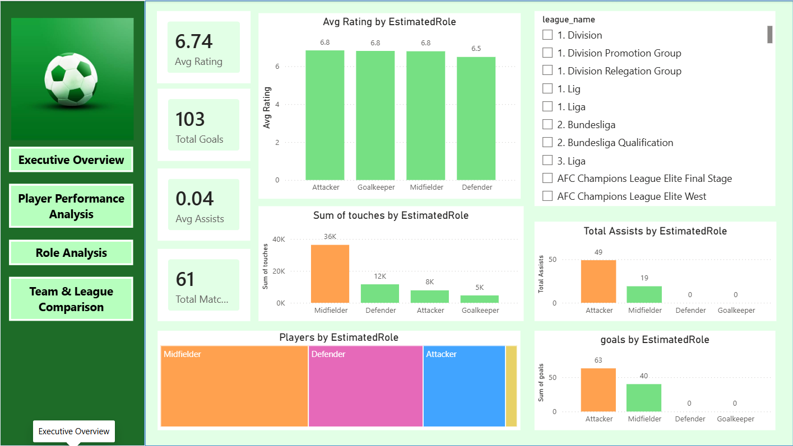
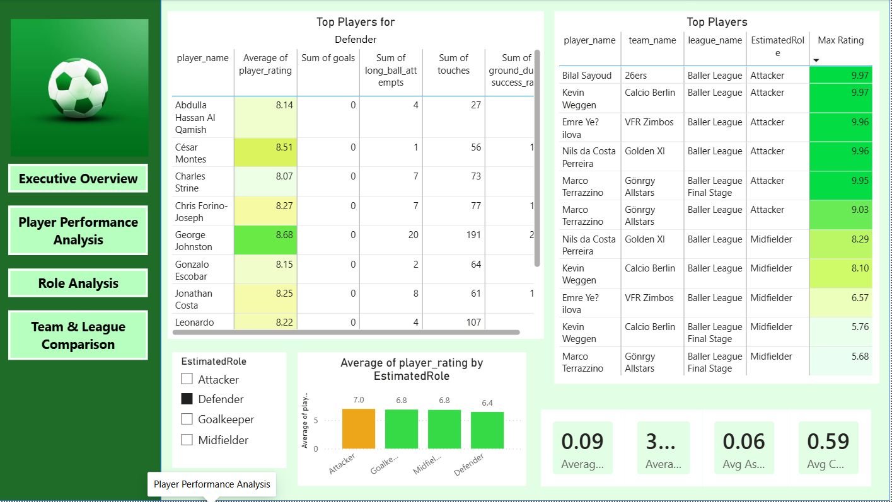
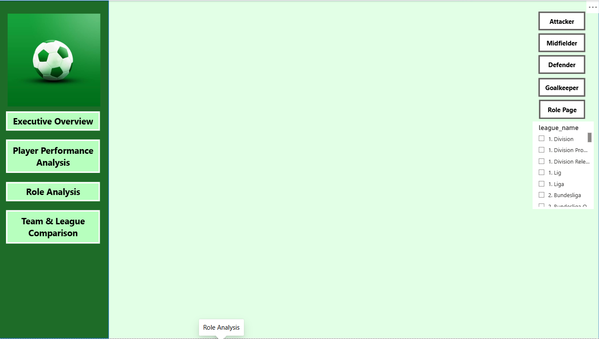
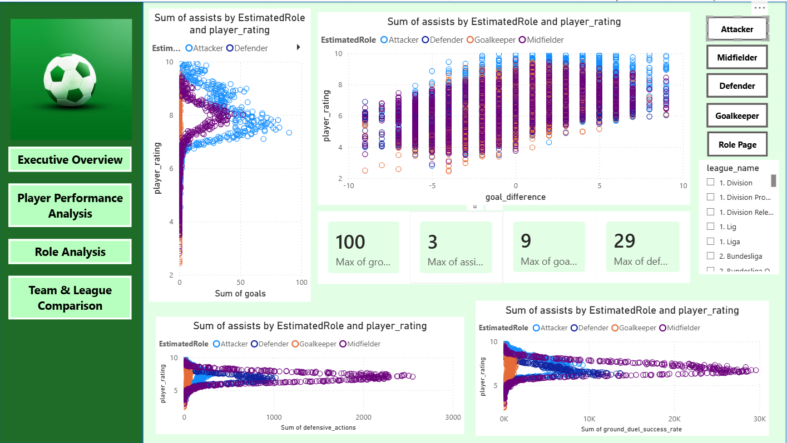
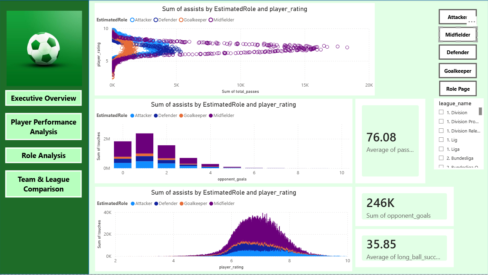
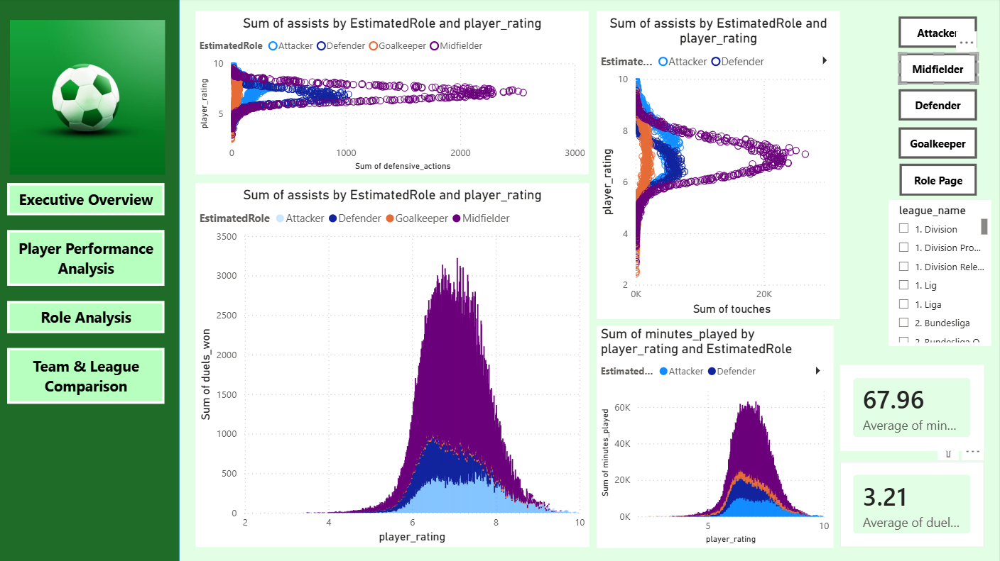
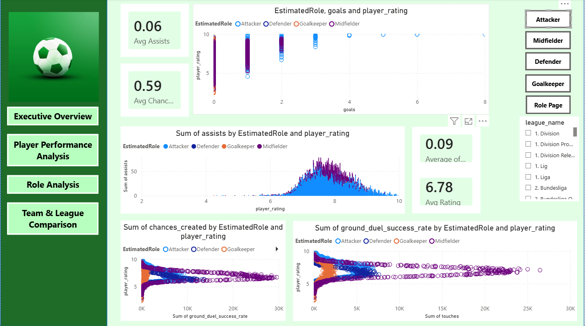
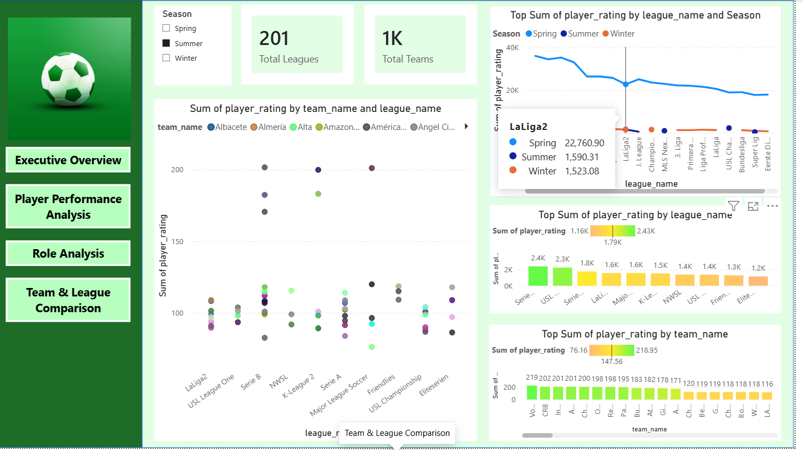

# Football-Player-Rating-Analysis
Machine Learning and Power BI analysis of football player ratings.
# Football Player Rating Analysis

## Overview

This project analyzes football player performance using Machine Learning and Power BI.

The project includes:

- Data Cleaning
- ETL
- Feature Engineering
- Role Classification
- Correlation Analysis
- Machine Learning
- Power BI Dashboard

---

## Workflow

Raw Data

↓

EDA

↓

ETL

↓

Null Handling

↓

Feature Engineering

↓

EstimatedRole Classification

↓

Correlation Analysis

↓

Machine Learning Validation

↓

Cross Validation

↓

Power BI Dashboard

---

## Technologies

- Python
- Pandas
- NumPy
- Scikit-learn
- Power BI
- GitHub

---

## Machine Learning Models

Separate Random Forest models were developed for:

- Attackers
- Midfielders
- Defenders
- Goalkeepers

The models were validated using:

- Train/Test Split
- 5-Fold Cross Validation

---

## Dashboard Pages

- Executive Overview
- Player Performance Analysis
- Role Analysis
- Team & League Comparison

---

## Repository Structure

Football-Player-Rating-Analysis

├── dashboard_img
├── notebooks
├── powerbi
├── figures
└── README.md

### Executive Overview

---

### Player Performance

---

### Role Analysis

#### Role Analysis RolePage

#### Role Analysis page Midfielders

#### Role Analysis page Goalkeepers

#### Role Analysis page Defenders

#### Role Analysis page Attackers

### Team&LeagueComparison

